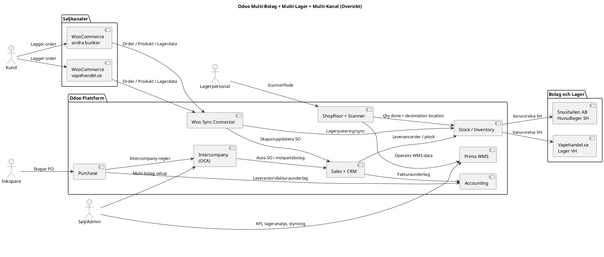
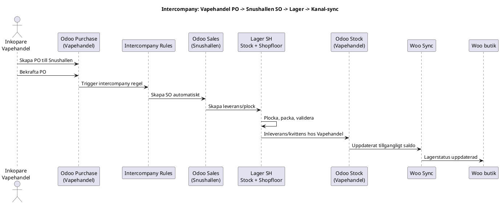
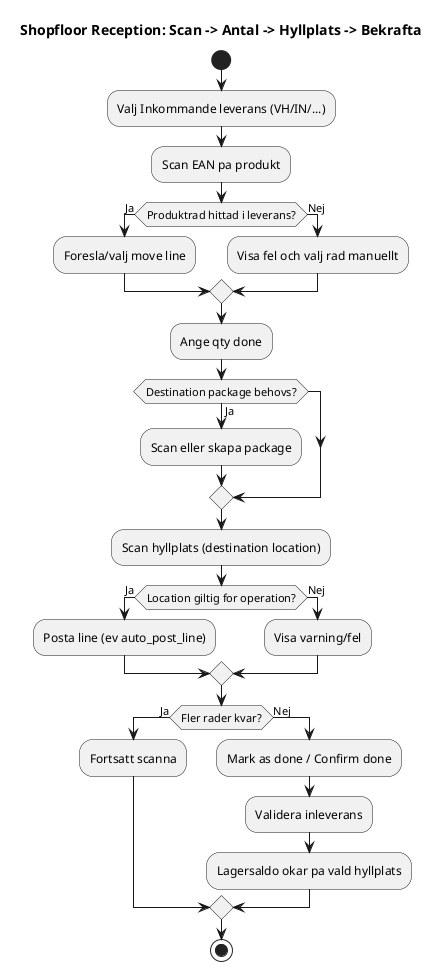
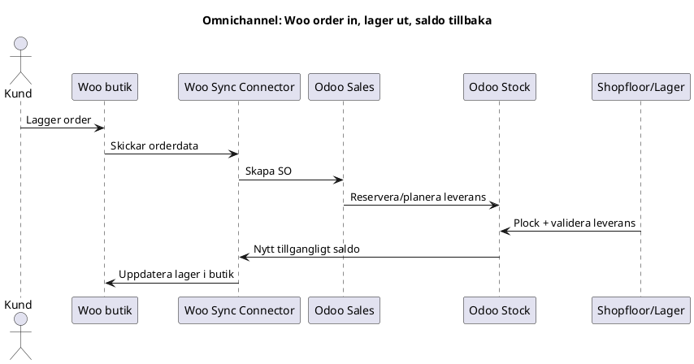

# Presentation: Multi-Lager och Multi-Kanal i Odoo

## 1. Syfte

Detta material visar:

- hur den nya Odoo-plattformen fungerar end-to-end
- hur floden for lager, salj, inkop, intercompany och WooCommerce syncar
- vilken nytta losningen ger jamfort med tidigare separata system
- vilka moduler/plugins som ar installerade och vad de ger for funktion

Primar målbild:

- `Snushallen i Norden AB` = huvudlager/grossist
- `vapehandel.se` (och andra bolag/kanaler) = aterforsaljare/saljkanaler
- ett gemensamt datalager med central styrning och spårbarhet

## 2. Problembild i gammal losning (separata system)

Typiska problem i den gamla kedjan:

- lager uppdaterades i flera system i olika tider
- intercompany mellan bolag kravde manuella steg
- order och inkop var inte alltid kopplade till faktisk varurorelse
- scannerfloden saknade konsekvent spårning till exakt hyllplats
- olika kanaler (Woo-butiker) hade risk for avvikande saldon

Konsekvenser:

- mer handarbete
- fler fel i saldo och leverans
- langre ledtid fran inkop till saljbar lagerstatus
- svagare kontroll i revision, support och efteranalys

## 3. Målbild i nya plattformen

- Odoo ar "single source of truth" for produkter, lager och order
- intercompany skapar SO/PO-floode mellan bolag automatiskt
- Shopfloor styr operativt scannerarbete i mottagning/plock
- WooCommerce sync skoter order in + lager ut till saljkanaler
- Prima WMS adderar lagerstyrning, KPI och lageroperativ struktur

## 4. UML: Overgripande arkitektur

Fil: `docs/uml/01_overview_component.puml`

## 5. UML: Intercompany orderflode

Fil: `docs/uml/02_intercompany_sequence.puml`

## 6. UML: Shopfloor scanner-mottagning

Fil: `docs/uml/03_shopfloor_reception_activity.puml`

## 7. UML: Omnichannel sync-flode

Fil: `docs/uml/04_omnichannel_sync_sequence.puml`

## 8. Affarsnytta jamfort med gammal separat losning

| Omrade | Tidigare (separat) | Nu (integrerad Odoo) |
|---|---|---|
| Lagerdata | Delad i flera system | Central realtid i ett system |
| Intercompany | Manuell PO/SO-hantering | Automatisk SO/PO-synk via regler |
| Scannerflode | Ojamn process | Standardiserat Shopfloor-flode |
| WooCommerce-sync | Risk for mismatch | Kontrollerad order/lager-sync |
| Spårbarhet | Svart att folja kedja | End-to-end logik i samma databas |
| Felkostnad | Hogre manuella fel | Lagre fel genom automation |
| Skalbarhet | Ny kanal = mer manuellt | Ny kanal = koppla connector/process |

## 9. Funktionella huvudfloden i praktiken

### A. Inleverans till lager (scanner)

- valj leverans
- scan EAN
- ange antal
- scan hyllplats
- bekrafta
- saldo uppdateras pa korrekt location

### B. Intercompany mellan bolag

- aterforsaljare lagger PO till grossist
- system skapar SO hos grossist
- grossist levererar
- mottagande bolag tar emot och far lager

### C. WooCommerce kanalflode

- order kommer in i Odoo
- leverans valideras i Odoo
- Woo lager uppdateras automatiskt

## 10. Rekommenderad KPI-uppfoljning (styrning)

- order-till-leverans tid per kanal
- inventeringsavvikelse i procent
- antal manuella korrigeringar per vecka
- servicegrad (OTIF)
- returgrad och orsakskod
- differens mellan Woo lager och Odoo lager

## 11. Implementeringsstrategi (for ledning)

Fas 1:

- stabilisera masterdata (produkt, EAN, location)
- lasa scannerfloden for mottagning

Fas 2:

- hardstyr intercompany-regler
- etablera standardflode for SH -> VH

Fas 3:

- utoka till fler saljkanaler/bolag
- KPI-dashboard och SLA-uppfoljning

## 12. Moduloversikt: installerad funktionalitet

Kalla: `install_all_departments.py`

### Core-moduler (Odoo)

| Modul | Funktion |
|---|---|
| `contacts` | Kontakthantering |
| `mail` | Diskussioner / Intern chatt |
| `calendar` | Kalender |
| `sale_management` | Försäljning |
| `crm` | CRM – Kundrelationer & Pipeline |
| `purchase` | Inköp |
| `stock` | Lager / Inventory |
| `barcodes` | Streckkoder |
| `account` | Bokföring |
| `account_payment` | Betalningar |
| `hr` | Personal / Anställda |
| `hr_attendance` | Närvaroregistrering |
| `hr_holidays` | Frånvaro / Semester |
| `hr_expense` | Utlägg |
| `hr_recruitment` | Rekrytering |
| `project` | Projekthantering |
| `hr_timesheet` | Tidrapportering |
| `mrp` | Tillverkning / MRP |
| `website` | Webbplats / Portal |
| `website_sale` | Webbshop |
| `mass_mailing` | E-postmarknadsföring |

### OCA + Custom moduler

| Modul | Funktion |
|---|---|
| `queue_job` | Bakgrundsjobb (OCA Queue) |
| `queue_job_cron_jobrunner` | Cron-baserad jobbkörare |
| `account_invoice_inter_company` | Mellanbolagsfakturor |
| `purchase_sale_inter_company` | Skapa SO automatiskt från PO mellan bolag |
| `purchase_sale_stock_inter_company` | Intercompany med lager/plock-synk |
| `component` | Komponentramverk (dependency) |
| `endpoint_route_handler` | Dynamiska API-endpoints (dependency) |
| `base_rest` | REST-baslager för shopfloor (dependency) |
| `stock_storage_type` | Lagringstyp (dependency för shopfloor) |
| `shopfloor_base` | Shopfloor bas |
| `shopfloor_mobile_base` | Shopfloor mobil bas |
| `auth_api_key_group` | API-nyckelgrupper (dependency för shopfloor auth) |
| `shopfloor_mobile_base_auth_api_key` | Shopfloor API-nyckel inloggning |
| `shopfloor` | Shopfloor scannerflöden |
| `shopfloor_reception` | Shopfloor mottagning |
| `shopfloor_mobile` | Shopfloor mobilgränssnitt |
| `shopfloor_reception_mobile` | Shopfloor mobil mottagning |
| `woocommerce_sync` | WooCommerce Sync |
| `prima_wms` | Prima WMS Extension |
| `stock_no_negative` | Förbjud negativt lagersaldo |
| `stock_picking_back2draft` | Återöppna avbrutna leveranser |
| `stock_split_picking` | Dela leveranser |
| `stock_picking_batch_creation` | Batch-plock |
| `stock_picking_auto_create_lot` | Auto-skapa lot vid inleverans |
| `barcodes_generator_product` | Streckkodsgenerator för produkter |
| `product_multi_barcode` | Flera streckkoder per produkt |
| `delivery_carrier_label_default` | Standard fraktetikett |
| `delivery_state` | Spårningsstatus frakt |
| `rma` | Returhantering |
| `rma_sale` | Returer från försäljning |
| `helpdesk_mgmt` | Helpdesk – Ärendehantering |
| `helpdesk_mgmt_sla` | Helpdesk SLA |
| `crm_phonecall` | CRM Telefonsamtal |
| `crm_lead_code` | Sekventiella leads |
| `hr_employee_firstname` | Förnamn/Efternamn separerat |
| `hr_appraisal_oca` | Medarbetarsamtal |
| `project_key` | Projektnycklar |
| `project_task_code` | Uppgiftskoder |
| `project_timesheet_time_control` | Tidkontroll i projekt |
| `quality_control_oca` | Kvalitetskontroll |
| `mrp_multi_level` | MRP Scheduler |
| `date_range` | Datumintervall (beroende) |
| `report_xlsx` | Excel-rapporter (beroende) |
| `account_financial_report` | Finansrapporter (OCA) |
| `account_tax_balance` | Skattebalans |
| `partner_statement` | Kontoutdrag kund/leverantör |
| `product_sequence` | Produktsekvenser |
| `product_manufacturer` | Tillverkare på produkt |
| `product_state` | Produktstatus / Livscykel |
| `product_variant_default_code` | Auto-generera artikelnummer varianter |
| `mail_gateway` | Mail Gateway |
| `auto_backup` | Automatisk databasbackup |
| `auditlog` | Granskningslogg |
| `module_auto_update` | Auto-uppdatera moduler |
| `web_responsive` | Responsivt gränssnitt |
| `web_environment_ribbon` | Miljö-band (dev/staging/prod) |
| `web_refresher` | Uppdateringsknapp i huvudmenyn |

## 13. Sammanfattning till beslutsgrupp

Nya losningen ger:

- en standardiserad process for flera lager och bolag
- kontroll pa intercompany utan dubbelregistrering
- stabilare lager mot Woo-kanaler
- battre precision i mottagning/plock via scanner
- skalbar plattform for fler bolag, lager och kanaler

Detta minskar operationell risk och gor expansion enklare utan att okad komplexitet maste hanteras manuellt.

